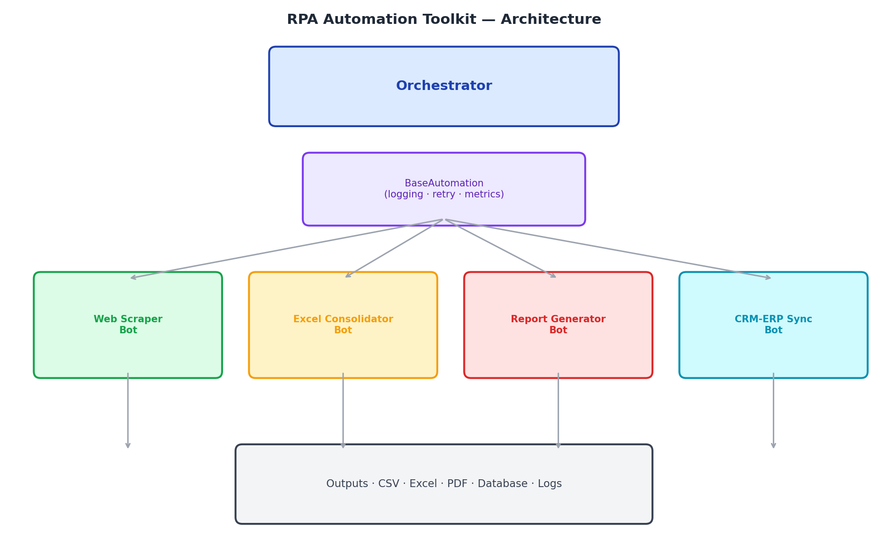
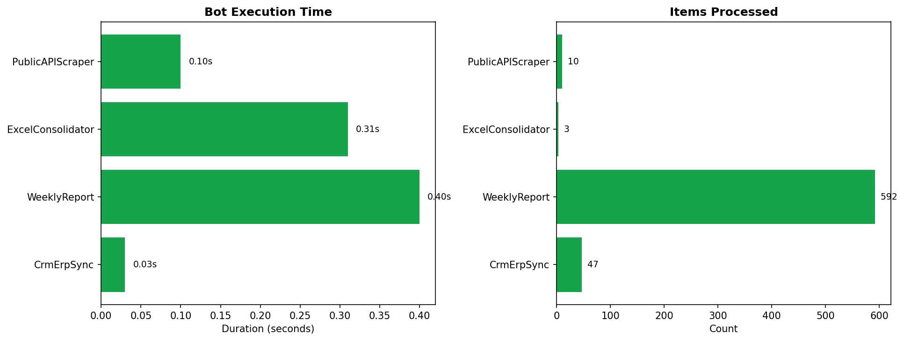

# RPA Automation Toolkit

Production-grade automation framework demonstrating the four most common patterns I work with professionally: **web scraping**, **Excel processing**, **report generation**, and **system integration**. Built as an educational, open-source companion to the UiPath bots I develop at work.


---

## About this project

I work professionally with UiPath, building RPA bots that automate operational processes. This repository is **not** the code I write at work — that code is proprietary. Instead, it's an open-source toolkit that recreates the **same patterns** with Python and synthetic data, so that:

- Anyone can clone, run, and read the code without UiPath licenses
- The patterns are demonstrable in interviews and code reviews
- The framework choices (base class, retry, structured logging, orchestrator) match what I implement at work in REFramework

For each Python automation, the [`uipath_workflows/`](uipath_workflows/README.md) folder contains the equivalent UiPath workflow as pseudo-code (the activities a developer would drag onto the Designer canvas). This makes the mapping between the two worlds explicit.

---

## What's inside

### Architecture


### Four reference automations

| Bot | What it does | Real-world equivalent |
| --- | --- | --- |
| **WebScraperBot** | Pulls structured data from an external API, falls back to mock data when offline | Daily competitor-price extraction, supplier catalog sync |
| **ExcelConsolidatorBot** | Reads N Excel files from a folder, normalizes columns, deduplicates, writes a master sheet | Monday morning consolidation of regional sales spreadsheets |
| **WeeklyReportBot** | Loads a clean dataset, builds charts, generates a formatted HTML/PDF report | Weekly leadership report that an analyst spends 4h on |
| **CrmErpSyncBot** | Detects CRM updates in the last 24h and upserts them into the ERP database | Eliminates manual data re-entry between systems that don't speak to each other |

### Run-time metrics (sample)


---

## Why a base framework matters

Without a shared foundation, every RPA bot reinvents the wheel: setting up logging, handling retries, recording metrics. The result is dozens of subtly-different bots that nobody can maintain. This toolkit follows the same principle as UiPath's REFramework: **one base class, four lifecycle hooks, consistent observability everywhere**.

```python
class MyBot(BaseAutomation):
    def setup(self):    ...   # open browser, connect API, etc.
    def run(self):      ...   # the actual work — must be implemented
    def teardown(self): ...   # cleanup runs even on failure
```

The `BaseAutomation` class handles:

- **Structured logging** — every bot writes timestamped logs to `data/logs/{bot}_{date}.log`
- **Retry with exponential backoff** — `@retry(max_attempts=3)` decorator wraps any function
- **Metrics reporting** — JSON metrics file per run, picked up by the orchestrator
- **Guaranteed teardown** — cleanup runs even if `run()` raises (no leaked resources)
- **Standardized status** — every run ends as `success`, `partial`, or `failed`

---

## REFramework alignment

The Python lifecycle maps 1:1 to UiPath's REFramework states, so a developer who knows one immediately understands the other:

| REFramework state | Python equivalent | Purpose |
| ----------------- | ----------------- | ------- |
| Init              | `setup()`         | Open browser, connect API, read config |
| Process           | `run()`           | Main automation logic |
| End Process       | `teardown()` + `report()` | Cleanup + persist metrics |

See [`uipath_workflows/README.md`](uipath_workflows/README.md) for the equivalent UiPath workflow of each Python bot.

---

## Project structure

```
rpa-automation-toolkit/
├── automations/                    # Each bot is self-contained
│   ├── web_scraping/
│   │   └── api_scraper_bot.py
│   ├── excel_processing/
│   │   └── excel_consolidator_bot.py
│   ├── report_generation/
│   │   └── weekly_report_bot.py
│   └── system_integration/
│       └── crm_erp_sync_bot.py
│
├── src/
│   ├── utils/
│   │   ├── base_automation.py      # Shared framework (logging, retry, metrics)
│   │   └── generate_charts.py
│   └── scheduler/
│       └── orchestrator.py         # Runs all bots and produces dashboard
│
├── uipath_workflows/               # UiPath pseudo-code for each automation
│   └── README.md
│
├── tests/                          # 9 pytest tests covering framework + bots
├── data/
│   ├── input/                      # Watched folder for bots that consume files
│   ├── output/                     # Where bots drop their results
│   └── logs/                       # Per-bot log files + metrics JSON
│
├── images/                         # Architecture diagram + run-metrics chart
├── requirements.txt
├── README.md
└── LICENSE
```

---

## Quick start

```bash
git clone https://github.com/<your-username>/rpa-automation-toolkit.git
cd rpa-automation-toolkit

python -m venv venv && source venv/bin/activate     # Windows: venv\Scripts\activate
pip install -r requirements.txt

# Run all bots end-to-end (this is the "press one button" entry point)
python src/scheduler/orchestrator.py

# Or run a single bot
python automations/excel_processing/excel_consolidator_bot.py

# Run the test suite
pytest tests/ -v

# Generate the architecture diagram and run-metrics chart
python src/utils/generate_charts.py
```

After running the orchestrator, open `data/output/orchestrator_dashboard.html` in a browser. The weekly report is at `data/output/weekly_report.html`.

---

## Key engineering decisions

### Mock fallback for the web scraper
The scraper hits a public API by default, but transparently falls back to a local mock dataset when the network is unreachable. This means the orchestrator runs end-to-end in CI environments and offline demos — no skipped bots, no flaky test suites. In production, this same pattern protects bots from intermittent vendor-API outages.

### One bot file = one Python file
Every automation is self-contained in a single file. Easier code review, easier scheduling (you can run a single bot without dependencies on others), easier to retire (delete the file when the process is decommissioned).

### Idempotent demo data
`ExcelConsolidatorBot` and `CrmErpSyncBot` generate sample input data on first run. This matters for reviewers — anyone can clone the repo and the bots run successfully without any manual setup steps. Idempotency also matters in production: a bot that crashes mid-run must be safe to re-trigger.

### CI runs every bot
GitHub Actions runs the full orchestrator on every push, across Python 3.10/3.11/3.12. If any bot regresses or any test breaks, CI fails before merge. This is the same discipline that production RPA teams enforce — bots that silently start failing are how organizations lose trust in automation.

### Why retry + exponential backoff
Network calls, desktop apps, and Excel files all fail intermittently. Retrying once and giving up is wasteful; retrying five times in a tight loop is hostile. The decorator `@retry(max_attempts=3, backoff_seconds=2.0)` is the production sweet spot — three tries with 2 → 4 → 8 second waits.

---

## What this demonstrates for hiring

This repository is intentionally small (~700 lines of Python) but covers a lot of ground that hiring managers care about for analyst and RPA developer roles:

- **End-to-end thinking** — From data ingestion through transformation to delivered output
- **Production discipline** — Logging, retry, metrics, tests, CI/CD
- **Pattern recognition** — Same base class for four very different jobs
- **Domain fluency** — Direct UiPath equivalents documented for every Python bot
- **Pragmatism** — Knew when to use Python vs. UiPath, when to mock vs. integrate

If you're hiring for a role that automates back-office processes — operations, finance, customer success — this is the kind of toolkit you want the new hire to be able to ship on week one.

---

## Roadmap

- [ ] Slack/Teams notification on bot completion
- [ ] Streamlit dashboard for cross-run trend analysis (success rate over time)
- [ ] Email-attachment processing bot (download + parse PDFs)
- [ ] Browser automation bot using Playwright (for sites without an API)
- [ ] CRON-based scheduler integrated into the orchestrator
- [ ] Real UiPath `.xaml` companion files (compiled UiPath project)

---

## About the author

**Matheus Raul Silvestresan** — Data Analyst with hands-on UiPath experience building RPA bots in a corporate environment. This toolkit reflects the patterns I implement professionally, recreated as an open-source educational resource.

- LinkedIn: [matheus-raul-silvestresan](https://www.linkedin.com/in/matheus-raul-silvestresan/)
- Email: matheusraulm1@gmail.com
- Location: São Paulo, Brazil 🇧🇷
- Open to remote and hybrid opportunities (LATAM / global)

---

## License

MIT — see [LICENSE](LICENSE).

> **A note on confidentiality:** The bots I build at Growth 7 are proprietary to the company. This repository contains zero proprietary code, data, or business logic. It demonstrates the **patterns and engineering practices** I apply professionally, using synthetic data and public APIs. Companies should expect new hires to bring their patterns and discipline — not their previous employer's intellectual property.
